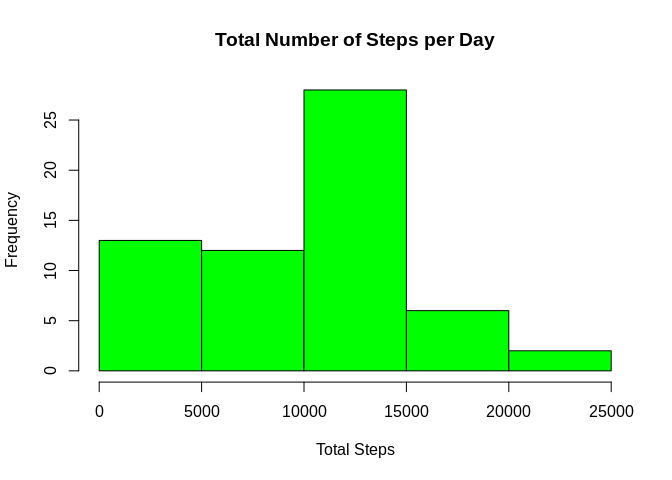
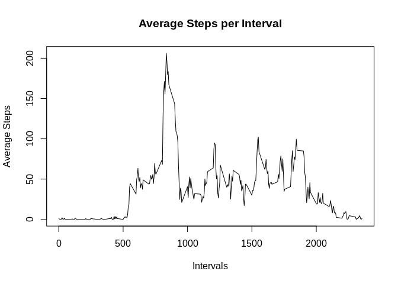
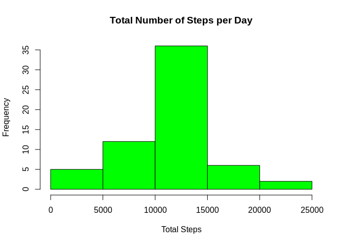
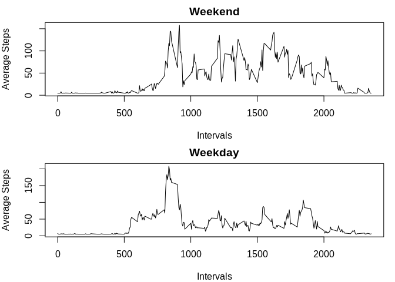

## Loading and preprocessing the data


```r
activity<-read.csv("activity.csv",header = TRUE)
activity[,2]<-as.Date(activity$date)
str(activity)
```

```
## 'data.frame':	17568 obs. of  3 variables:
##  $ steps   : int  NA NA NA NA NA NA NA NA NA NA ...
##  $ date    : Date, format: "2012-10-01" "2012-10-01" ...
##  $ interval: int  0 5 10 15 20 25 30 35 40 45 ...
```


## What is mean total number of steps taken per day?
#### Let’s first build and see the histogram of total steps per day

```r
steps_1<-with(activity,tapply(steps,date,sum,na.rm=TRUE))
hist(steps_1,col = "green",xlab = "Total Steps",ylab = "Frequency",main = "Total Number of Steps per Day")
```

<!-- -->
#### Now, let’s see the average total steps and median of total steps taken each day

```r
print(mean_steps<-mean(steps_1))
```

```
## [1] 9354.23
```

```r
print(median_steps<-median(steps_1))
```

```
## [1] 10395
```

```r
summary(steps_1)
```

```
##    Min. 1st Qu.  Median    Mean 3rd Qu.    Max. 
##       0    6778   10395    9354   12811   21194
```

## What is the average daily activity pattern?
#### Let’s first make a time series plot of the 5-minute interval (x-axis) and the average number of steps taken, averaged across all days (y-axis).

```r
avg_steps<-with(activity,tapply(steps,interval,mean,na.rm=TRUE))
intervals<-unique(activity$interval)
new<-data.frame(cbind(avg_steps,intervals))
plot(new$intervals,new$avg_steps,type = "l",xlab = "Intervals",
     ylab = "Average Steps",main = "Average Steps per Interval")
```

<!-- -->
#### Now, let’s see which 5-minute interval contains the maximum number of steps

```r
index<-which.max(new$avg_steps)
(max<-new[index,2])
```

```
## [1] 835
```

## Imputing missing values

```r
sum(is.na(activity$steps))
```

```
## [1] 2304
```

```r
index<-which(is.na(activity$steps))
l<-length(index)
steps_avg<-with(activity,tapply(steps,date,mean,na.rm=TRUE))
na<-mean(steps_avg,na.rm = TRUE)
for (i in 1:l) {
        activity[index[i],1]<-na
}
```
#### Let’s see if we filled all NAs properly and see how our new dataset looks like

```r
sum(is.na(activity$steps))
```

```
## [1] 0
```
#### Let’s see the histogram of total steps taken each day with the new dataset

```r
steps_2<-with(activity,tapply(steps,date,sum,na.rm=TRUE))
hist(steps_2,col = "green",xlab = "Total Steps",ylab = "Frequency",main = "Total Number of Steps per Day")
```

<!-- -->
#### Let’s calculate and see the mean and median of the total steps taken each day

```r
print(mean_steps_2<-mean(steps_2))
```

```
## [1] 10766.19
```

```r
print(median_steps_2<-median(steps_2))
```

```
## [1] 10766.19
```


## Are there differences in activity patterns between weekdays and weekends?

```r
library(dplyr)
```

```
## 
## Attaching package: 'dplyr'
```

```
## The following objects are masked from 'package:stats':
## 
##     filter, lag
```

```
## The following objects are masked from 'package:base':
## 
##     intersect, setdiff, setequal, union
```

```r
activity_mod<- mutate(activity, day = ifelse(weekdays(activity$date) == "Saturday" | weekdays(activity$date) == "Sunday", "weekend", "weekday"))
activity_mod$day<-as.factor(activity_mod$day)
str(activity_mod)
```

```
## 'data.frame':	17568 obs. of  4 variables:
##  $ steps   : num  37.4 37.4 37.4 37.4 37.4 ...
##  $ date    : Date, format: "2012-10-01" "2012-10-01" ...
##  $ interval: int  0 5 10 15 20 25 30 35 40 45 ...
##  $ day     : Factor w/ 2 levels "weekday","weekend": 1 1 1 1 1 1 1 1 1 1 ...
```


### Now, let’s plot the weekday and weekend data in seperate graphs

```r
act_wknd<-subset(activity_mod,as.character(activity_mod$day)=="weekend")
act_wkdy<-subset(activity_mod,as.character(activity_mod$day)=="weekday")
steps_wknd<-with(act_wknd,tapply(steps,interval,mean,na.rm=TRUE))
steps_wkdy<-with(act_wkdy,tapply(steps,interval,mean,na.rm=TRUE))
int_wknd<-unique(act_wknd$interval)
int_wkdy<-unique(act_wkdy$interval)
new_wknd<-data.frame(cbind(steps_wknd,int_wknd))
new_wkdy<-data.frame(cbind(steps_wkdy,int_wkdy))
par(mfrow=c(2,1),mar=c(4,4,2,1))
plot(new_wknd$int_wknd,new_wknd$steps_wknd,type = "l",xlab = "Intervals",
     ylab = "Average Steps",main = "Weekend")
plot(new_wkdy$int_wkdy,new_wkdy$steps_wkdy,type = "l",xlab = "Intervals",
     ylab = "Average Steps",main = "Weekday")
```

<!-- -->

#### It is clear that the average steps over the weekends show higher pattern than that of the weekdays
